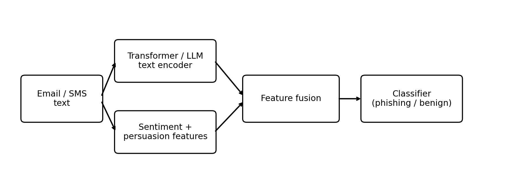

# LLM Phishing Detection with Sentiment & Persuasion Signals

مشروع GitHub تعليمي لشرح **كشف هجمات التصيد المتقدمة** عبر الجمع بين:

1. تمثيل لغوي حديث للنصوص عبر نموذج Transformer / LLM-ready pipeline.
2. خصائص دلالية وعاطفية خفيفة الوزن مثل الاستعجال، التخويف، الإغراء، الطلبات الإجرائية، وعدد الروابط.
3. طبقة تصنيف نهائية تميّز بين الرسائل **الخبيثة** والرسائل **السليمة**.

> المستودع موجه للشرح الأكاديمي داخل الماجستير، وليس لإنتاج نتيجة بحثية نهائية من عينة toy dataset.

## لماذا هذا المشروع؟

الأدبيات الحديثة في كشف التصيد تشير إلى أن النماذج التقليدية القائمة على القواعد وحدها لا تكفي أمام الرسائل المتقدمة، وأن نماذج Transformer وBERT/RoBERTa أصبحت جزءًا مهمًا من خطوط الكشف الحديثة. كما أن أعمالًا أحدث ربطت بين كشف التصيد وبين مبادئ الإقناع النفسي مثل الاستعجال والسلطة والندرة. لهذا بُني هذا المستودع على فكرة **المسار الهجين**: فهم دلالي للنص + مؤشرات شعورية/إقناعية قابلة للتفسير. راجع المراجع في نهاية الملف.

## ما الذي ستجده داخل المستودع؟

- **Baseline runnable**: `TF-IDF + Logistic Regression`
- **Hybrid runnable**: `TF-IDF + sentiment/persuasion features + Logistic Regression`
- **Transformer hybrid script**: تدريب نموذج Transformer مع دمج الخصائص الرقمية
- **Optional local LLM benchmark**: تقييم عبر Ollama لتجارب prompt-based classification
- **Synthetic teaching dataset**: ملف صغير للتشغيل السريع داخل GitHub Actions
- **Project paper in Arabic**: داخل `reports/project_paper_ar.md`
- **Teaching notebook**: داخل `notebooks/teaching_demo.ipynb`

## بنية المشروع

```text
llm-phishing-sentiment-detection/
├── .github/workflows/python-smoke-test.yml
├── data/
│   ├── data_card.md
│   └── demo_emails.csv
├── figures/
│   ├── demo_metrics.png
│   └── pipeline.png
├── notebooks/
│   └── teaching_demo.ipynb
├── reports/
│   ├── project_paper_ar.md
│   └── teaching_notes_ar.md
├── results/
│   ├── baseline/
│   ├── hybrid/
│   ├── demo_comparison.csv
│   └── demo_summary.md
├── scripts/
│   ├── run_demo.sh
│   └── summarize_results.py
├── src/
│   ├── build_demo_dataset.py
│   ├── data_utils.py
│   ├── features.py
│   ├── lexicons.py
│   ├── llm_prompt_eval.py
│   ├── train_baseline.py
│   ├── train_hybrid.py
│   └── train_transformer.py
├── requirements.txt
└── requirements-llm.txt
```

## معمارية الحل



**المسار الأول**: تمثيل النص عبر Transformer/LLM.

**المسار الثاني**: استخراج خصائص sentiment/persuasion مثل:
- urgency_count
- threat_count
- reward_count
- action_count
- credential_count
- num_urls
- sentiment_balance
- emotion_intensity

**الدمج**: دمج التمثيل النصي مع الخصائص الرقمية ثم تصنيف الرسالة إلى `phishing` أو `benign`.

## تشغيل سريع

### 1) تثبيت المتطلبات الأساسية

```bash
pip install -r requirements.txt
```

### 2) تشغيل نسخة العرض التعليمية

```bash
bash scripts/run_demo.sh
```

### 3) تشغيل النموذجين يدويًا

```bash
python -m src.train_baseline --data data/demo_emails.csv --outdir results/baseline
python -m src.train_hybrid --data data/demo_emails.csv --outdir results/hybrid
python scripts/summarize_results.py
```

### 4) تدريب النسخة المعتمدة على Transformer

```bash
pip install -r requirements-llm.txt
python -m src.train_transformer   --data data/demo_emails.csv   --outdir results/transformer_hybrid   --model-name distilroberta-base
```

### 5) تجربة LLM محلي عبر Ollama

```bash
OLLAMA_MODEL=llama3.1:8b python -m src.llm_prompt_eval   --data data/demo_emails.csv   --outdir results/ollama_eval
```

## نتائج العرض السريع الحالية

نتائج `scripts/run_demo.sh` على **البيانات التعليمية الصناعية** الموجودة داخل المستودع:

| Model | Accuracy | Precision | Recall | F1 |
|---|---:|---:|---:|---:|
| Baseline TF-IDF + LR | 1.000 | 1.000 | 1.000 | 1.000 |
| Hybrid TF-IDF + Sentiment | 1.000 | 1.000 | 1.000 | 1.000 |

> هذه الأرقام مرتفعة جدًا لأن dataset المرفق **Synthetic / Clean / Small** ومقصود به فقط التحقق من أن الكود يعمل على GitHub وفي الشرح داخل الصف. لا ينبغي اعتبارها benchmark بحثيًا.

## أكثر الخصائص الرقمية تأثيرًا في نموذج الدمج الحالي

- `action_count`: 1.267
- `financial_count`: 0.938
- `reward_count`: 0.914
- `negative_count`: 0.904
- `emotion_intensity`: 0.864
- `num_urls`: 0.843
- `urgency_count`: 0.767
- `threat_count`: 0.681

هذه القائمة مفيدة داخل الشرح؛ لأنها توضح أن النموذج لا يعتمد على “الصندوق الأسود” فقط، بل يمكن تفسيره عبر إشارات لغوية مثل الأفعال الإجرائية، الإغراء المالي، الروابط، والاستعجال.

## كيف تستخدمه مع بيانات حقيقية؟

1. جهز ملف CSV يحتوي على عمودين: `text`, `label`.
2. استبدل `data/demo_emails.csv` ببيانات حقيقية أو مرر المسار الجديد عبر `--data`.
3. شغّل baseline ثم hybrid.
4. قارن `accuracy`, `precision`, `recall`, `f1`.
5. اعرض أوزان الخصائص، وأهم العبارات النصية، وتحليل الأخطاء.

## GitHub Actions

تمت إضافة workflow بسيط داخل:

```text
.github/workflows/python-smoke-test.yml
```

الوظيفة تقوم بـ:
- تثبيت المتطلبات الأساسية
- فحص compile للمصادر
- تشغيل demo benchmark تلقائيًا بعد كل push أو pull request


